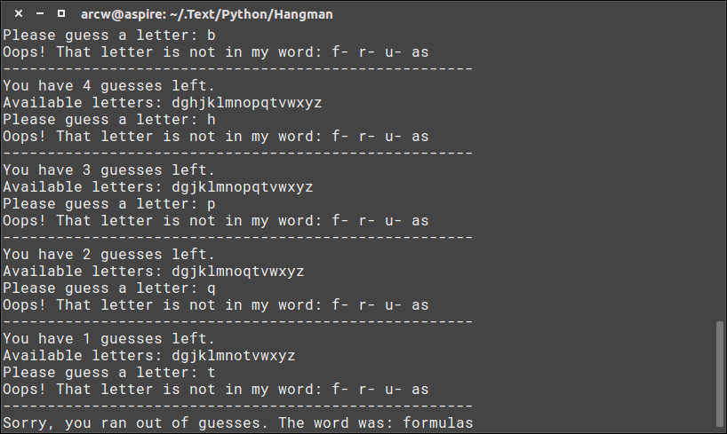
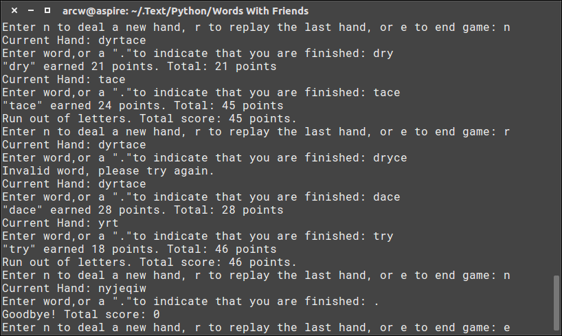
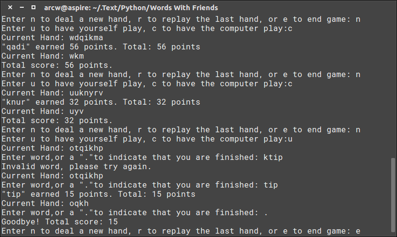

# Python写的一些小程序

### 1. Hangman猜词小游戏

​	要猜的字以一列横线表示，让玩家知道该字有多少个字母。如果玩家猜中其中一个字母，则该字母出现的所有位置上就会出现该字母。如果猜的字母没有于该字中出现，玩家的猜测机会会减少一次。游戏会在以下情况结束：

1. 玩家猜测出所有字母，或猜中整个字
2. 玩家用尽所有机会仍没有猜测出该字



开始游戏：

```code
$ python ps3_hangman.py
```

-----

### 2. The Caesar Cipher解密工具

​	在[密码学](https://zh.wikipedia.org/wiki/%E5%AF%86%E7%A0%81%E5%AD%A6)中，**恺撒密码**（英语：Caesar cipher），或称**恺撒加密**、**恺撒变换**、**变换加密**，是一种最简单且最广为人知的加密技术。它是一种[替换加密](https://zh.wikipedia.org/wiki/%E6%9B%BF%E6%8D%A2%E5%BC%8F%E5%AF%86%E7%A0%81)的技术，[明文](https://zh.wikipedia.org/wiki/%E6%98%8E%E6%96%87)中的所有字母都在[字母表](https://zh.wikipedia.org/wiki/%E5%AD%97%E6%AF%8D%E8%A1%A8)上向后（或向前）按照一个固定数目进行偏移后被替换成[密文](https://zh.wikipedia.org/wiki/%E5%AF%86%E6%96%87)。例如，当偏移量是3的时候，所有的字母A将被替换成D，B变成E，以此类推。这个加密方法是以罗马共和时期[恺撒](https://zh.wikipedia.org/wiki/%E6%81%BA%E6%92%92)的名字命名的，当年恺撒曾用此方法与其将军们进行联系。


运行：

```code
$ python ps6.py
```

**注：需要破解内容的文件为同目录下的story.txt**

---

### 3. Words With Friends小游戏

​	这个游戏很像Scrabble或Words With Friends，玩家需要从电脑随机生成的字符串中构造一个或多个单词。每个有效词都会根据单词的长度和单词中的字母得到一个分数。该游戏有两个版本：

1. 玩家版：

   运行：

   ```code
   $ python ps4a.py
   ```

2. 电脑版：

   

   运行：

   ```code
   $ python ps4b.py
   ```

   ​